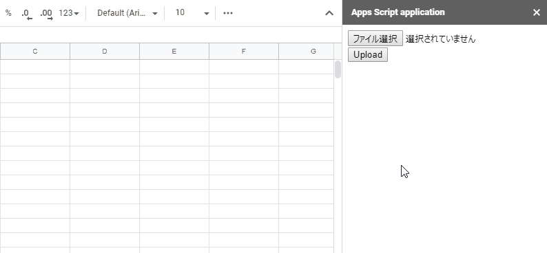

AsynchronousResumableUploadForGoogleDrive

# Resumable Upload of Multiple Files with Asynchronous Process for Google Drive

<a name="overview"></a>

# Overview

This is a sample script for uploading multiple files with large size (> 50 MB) at the sidebar, dialog of Google Docs and Web Apps using the resumable upload of the asynchronous process with Javascript and Google Apps Script (GAS).

<a name="demo"></a>

# Demo



This is a demonstration of this script. As a demonstration, it uploads 5 files with the size of 100 MB to own Google Drive. When the files were selected and the upload button is clicked, those are uploaded by [the resumable upload](https://developers.google.com/drive/api/v3/manage-uploads#resumable) with the asynchronous process. It is found that the files can be completely uploaded with the asynchronous process. In this demo, as a test case, the chunk size of 20 MB was used.

<a name="Description"></a>

# Description

Have you ever thought that you want to upload multiple files with large size with the asynchronous process from local PC at the sidebar, dialog and Web Apps using GAS? Recently, I have thought it. I have already been published "[Resumable Upload for Web Apps using Google Apps Script](https://github.com/tanaikech/Resumable_Upload_For_WebApps)". In that post, one file is uploaded. Here, I would like to introduce the sample script for uploading the multiple files with asynchronous process using the sidebar of Google Docs. In this case, this can be also used for the dialog and Web Apps.

If this was useful for you, I'm glad.

# Usage

Here, there are 2 scripts for Google Apps Script and Javascript. In order to use these sample scripts, please do the following flow. In this sample, the Javascript library of [ResumableUploadForGoogleDrive_js](https://github.com/tanaikech/ResumableUploadForGoogleDrive_js) is used.

## 1. Prepare Spreadsheet and script

Create new Spreadsheet. And open the script editor on the created Spreadsheet.

## 2. Copy and paste sample scripts

Please copy and paste the following scripts.

### Google Apps Script: Code.gs

```javascript
function main() {
  var html = HtmlService.createHtmlOutputFromFile("index");
  SpreadsheetApp.getUi().showSidebar(html);
}

function getAuth() {
  // DriveApp.createFile(blob) // This is used for adding the scope of "https://www.googleapis.com/auth/drive".
  return ScriptApp.getOAuthToken();
}
```

### HTML: index.html

```html
<input type="file" id="file" multiple="true" />
<input type="button" onclick="run()" value="Upload" />
<div id="progress"></div>

<script src="https://cdn.jsdelivr.net/gh/tanaikech/ResumableUploadForGoogleDrive_js@master/resumableupload_js.min.js"></script>
<script>
  function run() {
    google.script.run
      .withSuccessHandler(accessToken =>
        ResumableUploadForGoogleDrive(accessToken)
      )
      .getAuth();
  }

  function ResumableUploadForGoogleDrive(accessToken) {
    const f = document.getElementById("file");
    [...f.files].forEach((file, i) => {
      let fr = new FileReader();
      fr.fileName = file.name;
      fr.fileSize = file.size;
      fr.fileType = file.type;
      fr.readAsArrayBuffer(file);
      fr.onload = e => {
        var id = "p" + ++i;
        var div = document.createElement("div");
        div.id = id;
        document.getElementById("progress").appendChild(div);
        document.getElementById(id).innerHTML = "Initializing.";
        const f = e.target;
        const resource = {
          fileName: f.fileName,
          fileSize: f.fileSize,
          fileType: f.fileType,
          fileBuffer: f.result,
          accessToken: accessToken
        };
        const ru = new ResumableUploadToGoogleDrive();
        ru.Do(resource, function(res, err) {
          if (err) {
            console.log(err);
            return;
          }
          console.log(res);
          let msg = "";
          if (res.status == "Uploading") {
            msg =
              Math.round(
                (res.progressNumber.current / res.progressNumber.end) * 100
              ) +
              "% (" +
              f.fileName +
              ")";
          } else {
            msg = res.status + " (" + f.fileName + ")";
          }
          document.getElementById(id).innerText = msg;
        });
      };
    });
  }
</script>
```

## 3. Run scripts

Please run the function of `main` at the script editor. At that time, the authorization screen is opened. So please authorize the scopes. By this, a sidebar is opened on the Spreadsheet.

When your files are selected and you click the upload button, the files are uploaded to your Google Drive.

# References

- [Perform a resumable upload](https://developers.google.com/drive/api/v3/manage-uploads#resumable)
- [Resumable Upload for Web Apps using Google Apps Script](https://github.com/tanaikech/Resumable_Upload_For_WebApps)
- [ResumableUploadForGoogleDrive_js](https://github.com/tanaikech/ResumableUploadForGoogleDrive_js)

---

<a name="licence"></a>

# Licence

[MIT](LICENCE)

<a name="author"></a>

# Author

[Tanaike](https://tanaikech.github.io/about/)

If you have any questions and commissions for me, feel free to tell me.

<a name="updatehistory"></a>

# Update History

- v1.0.0 (October 11, 2019)

  1. Initial release.

[TOP](#top)
